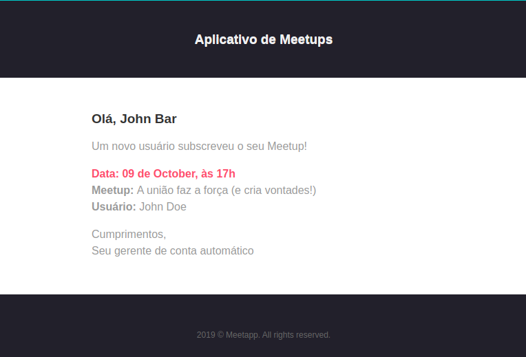
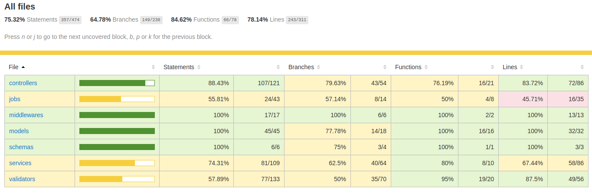

<p align="center">
  
</p>

# Backend em NodeJS para o desafio de certificação do Bootcamp GoStack da [Roketseat](http://rocketseat.com.br)

## Aplicação: API do Meetapp

Meetapp é um aplicativo de cadastro e inscrição em _meetups_, com as seguintes características:

1. O usuário deve realizar seu cadastro e se autenticar;
2. O usuário pode cadastrar quantos meetups desejar, mas não pode cadastrar com datas passadas. Pode editar ou cancelar os que criou e que ainda não aconteceram.
3. O usuário deve poder se inscrever em _meetups_ que não organiza, mas não pode se inscrever nos que já aconteceram. Também, não pode se inscrever no mesmo _meetup_ duas vezes e não pode se inscrever em dois _meetups_ que acontecem no mesmo horário.
4. Sempre que um usuário se inscrever no _meetup_, um e-mail é enviado ao organizador contendo os dados relacionados ao usuário inscrito

<p align="center">
  
</p>

## Instalação e Inicialização

- os bancos de dados escolhidos foram o postgres, mongodb e redis e as configurações deverão ser atualizadas no arquivo `.env`, no arquivo `.env.example` poderá ver um exemplo de configuração com os valores padrões.

```sh
cd backend
```

e

```sh
npm install
npm sequelize db:migrate
npm run dev
```

ou

```sh
yarn
yarn sequelize db:migrate
yarn dev
```

- para a execução de uma _queue_ que recebe jobs, no qual estão inclusos o de envio de emails e o de excluir imagens não usadas:

```sh
npm run queue
```

ou

```sh
yarn queue
```

## Seeds

Caso pretenda popular o banco de dados com alguns exemplos poderá fazê-lo correndo o seguinte comando:

- de forma a simplificar os _seeds_ foram disponibilizados para serem usados em um banco de dados sem prévias inserções.
- pode usar o `yarn` ou o `npm`

```sh
yarn sequelize db:seed:all
```

para refazer, deverá realizar um rollback das seeds primeiro:

```sh
yarn sequelize db:seed:undo:all
```

- pode optar por rodar as _migrations_, as _seeds_ e iniciar o _nodemon_ com um único comando, este comando irá reiniciar os dados do banco de dados _postgres_ de acordo com os _seeds_.

```sh
yarn dev-seed
```

## Rotas

Junto segue o arquivo ([Insominia_2019-10-13.json](./Insominia_2019-10-13.json)) para importar as rotas para o [Insomnia](https://insomnia.rest/)

| Método | Rota               | Privado |                                                                               |
| :----: | :----------------- | :-----: | ----------------------------------------------------------------------------- |
|  POST  | /users             |   NÃO   | criação de conta                                                              |
|  POST  | /sessions          |   NÃO   | autenticação de usuário                                                       |
|  PUT   | /users             |   SIM   | edição dos dados do usuário                                                   |
|  POST  | /banners           |   SIM   | upload e cadastro de imagem                                                   |
|  GET   | /meetups/user      |   SIM   | lista _meetups_ criados pelo usuário autenticado                              |
|  GET   | /meetups           |   SIM   | lista os _meetups_ com filtro por data e paginados com 10 itens               |
|  POST  | /meetups           |   SIM   | criação do _meetup_                                                           |
|  PUT   | /meetups/:id       |   SIM   | edição do _meetup_                                                            |
| DELETE | /meetups/:id       |   SIM   | exclusão de _meetup_                                                          |
|  GET   | /subscriptions     |   SIM   | lista as inscrições do usuário autenticado com data a partir da chamada à API |
|  POST  | /subscriptions     |   SIM   | criação de uma subscrição                                                     |
| DELETE | /subscriptions/:id |   SIM   | exclui uma subscrição                                                         |
|  GET   | /notifications     |   SIM   | lista as notificações para o usuário autenticado                              |
|  PUT   | /notifications/:id |   SIM   | atualiza o campo de leitura como verdadeiro                                   |

## Erros

A fim de manter a consistência nos _response errors_ todas as validações de requisição retornam um erro _status code_ 400 com a seguite estrutura JSON:

```json
{
  "error": "Validation fails",
  "messages": [
    {
      "name": "ValidationError",
      "path": "banner_id",
      "type": "required",
      "errors": ["banner_id is a required field"],
      "inner": [],
      "message": "banner_id is a required field",
      "params": {
        "path": "banner_id"
      }
    }
  ]
}
```

Para as validações das regras de negócio que não forem contempladas na requisição é lançado um erro que será capturado na saída da _response_, como por exemplo, todos os erros lançados nos arquivos dentro da pasta services.

Esses erros e outros serão tratados e formatados pelo _Youch_ e será permitido a saída das seguintes informações como abaixo:

1. em produção

```json
{
  "message": "Meetup not found",
  "name": "Error"
}
```

2. em desenvolvimento

```json
{
  "message": "Meetup not found",
  "name": "Error",
  "frames": [
    {
      "file": "src/app/services/DeleteMeetupService.js",
      "filePath": "/home/mourabraz/Documentos/GoStack/Desafio Certificação/backend/src/app/services/DeleteMeetupService.js",
      "method": "DeleteMeetupService.run",
      "line": 11,
      "column": 13,
      "context": {
        "start": 6,
        "pre": "\n    /**\n     * Check if meetup id exists and belongs to authenticated user\n     */\n    if (!meetup) {",
        "line": "      throw new Error('Meetup not found');",
        "post": "    }\n    if (meetup.user_id !== user_id) {\n      throw new Error('Request not permitted');\n    }\n"
      },
      "isModule": false,
      "isNative": false,
      "isApp": true
    }
  ]
}
```

## Teste

Os testes com o banco de dados ocorrem usando o sqlite por default. Caso queira usar o postgres deverá mudar o DB_DIALECT do arquivo .env.test para postgres e por default usa o banco de dados de nome meetapptest.

### Coverage

[tabela coverage](./__tests__/coverage/lcov-report/index.html) (`ctrl` ou `cmd` + click)

<p align="center">

</p>

## Segurança

## Extra

Um _cron_ manda para a fila de execução um _job_ (`VanishUnusedImages`) todos os dias às 01:00 AM UTC para procurar e excluir imagens gravadas durante o dia que antecede as 48 horas. Este tempo pode ser alterado dentro do arquivo `/config/constants.js` na variável de nome `HOURS_UTIL_VANISH_IMAGES`. As 48 horas foram escolhidas para haver uma certa segurança com o _cache_ de 24 horas (**Cache Não Implementado**).

- após a execução da _queue_ já relatada, pode iniciar o _cron_:

```sh
npm run cron
```

ou

```sh
yarn cron
```

## Agradecimentos

Aos desenvolvedores e mantenedores das seguintes bibliotecas:

- [@sentry/node (BSD 3-Clause License)](https://github.com/getsentry/sentry-javascript);
- [bcryptjs (MIT)](https://github.com/dcodeIO/bcrypt.js);
- [bee-queue (MIT)](https://github.com/bee-queue/bee-queue);
- [cors (MIT)](https://github.com/expressjs/cors);
- [date-fns (MIT)](https://github.com/date-fns/date-fns);
- [dotenv (BSD 2-Clause)](https://github.com/motdotla/dotenv);
- [express (MIT)](https://github.com/expressjs/express);
- [express-async-errors (ISC)](https://github.com/davidbanham/express-async-errors);
- [express-brute (MIT)](https://github.com/AdamPflug/express-brute);
- [express-brute-redis (MIT)](https://github.com/AdamPflug/express-brute-redis);
- [express-handlebars (BSD 3-Clause)](https://github.com/ericf/express-handlebars);
- [express-rate-limit (MIT)](https://github.com/nfriedly/express-rate-limit);
- [fs (MIT)]();
- [helmet (MIT)](https://github.com/helmetjs/helmet);
- [jsonwebtoken (MIT)](https://github.com/auth0/node-jsonwebtoken);
- [mongoose (MIT)](https://github.com/Automattic/mongoose);
- [multer (MIT)](https://github.com/expressjs/multer);
- [node-cron (ISC)](https://github.com/node-cron/node-cron);
- [nodemailer (MIT)](https://github.com/nodemailer/nodemailer);
- [nodemailer-express-handlebars (MIT)](https://github.com/yads/nodemailer-express-handlebars);
- [pg (MIT)](https://github.com/brianc/node-postgres);
- [pg-hstore (MIT)](https://github.com/scarney81/pg-hstore);
- [rate-limit-redis (MIT)](https://github.com/wyattjoh/rate-limit-redis);
- [redis (MIT)](https://github.com/NodeRedis/node_redis);
- [sequelize (MIT)](https://github.com/sequelize/sequelize);
- [youch (MIT)](https://github.com/poppinss/youch): e
- [yup (MIT)](https://github.com/jquense/yup).

## License

MIT © mourabraz@hotmail.com
