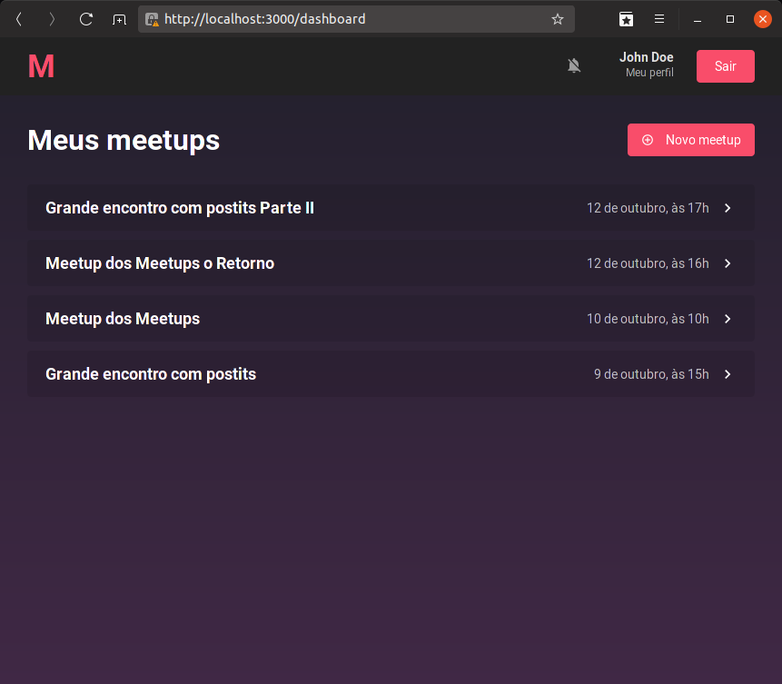

<p align="center">
  
</p>

# Frontend em ReactJS para o desafio de certificação do Bootcamp GoStack da [Roketseat](http://rocketseat.com.br)

## Aplicação: Frontend do Meetapp

O frontend utiliza a API do Meetapp ([pasta backend](../backend))

1. Esta aplicação será utilizada por organizadores de meetups e não fornece as funcionalidades de inscrição.

2. As páginas são:

- SigIn: para autenticação do usuário;
- SignUp: para criação de nova conta de usuário;
- Dashboard: páginal inicial quando autenticado e apresenta a lista de meetups criados (organizados) pelo usuário autenticado;
- Detalhes: exibe os detalhes de um Meetup selecionado;
- Novo/Editar: cria ou edita um meetup previamente cadastrado; e
- Perfil: para edição das informações do usuário autenticado.

<p align="center" style="margin: 25px 0">
  
  
  
  
  
  
  
</p>

## Instalação e Inicialização

```
cd frontend
```

e

```
npm install
```

ou

```
yarn
```

e

```
npm start
```

ou

```
yarn start
```

Acesse pelo Navegador:

[http://localhost:3000/](http://localhost:3000/)

## Agradecimentos

Aos desenvolvedores e mantenedores das seguintes bibliotecas:

- [@rocketseat/unform (MIT)](https://github.com/Rocketseat/unform);
- [axios (MIT)](https://github.com/axios/axios);
- [date-fns (MIT)](https://github.com/date-fns/date-fns);
- [date-fns-tz (MIT)](https://github.com/marnusw/date-fns-tz);
- [history (MIT)](https://github.com/ReactTraining/history);
- [immer (MIT)](https://github.com/immerjs/immer);
- [polished (MIT)](https://github.com/styled-components/polished);
- [prop-types (MIT)](https://github.com/facebook/prop-types);
- [react (MIT)](https://github.com/facebook/react);
- [react-datepicker (MIT)](https://github.com/Hacker0x01/react-datepicker);
- [react-dom (MIT)](https://github.com/facebook/react/tree/master/packages/react-dom);
- [react-icons (MIT)](https://github.com/react-icons/react-icons) **MaterialIcons (Apache License 2.0)**;
- [react-perfect-scrollbar (MIT)](https://github.com/goldenyz/react-perfect-scrollbar);
- [react-redux (MIT)](https://github.com/reduxjs/react-redux);
- [react-router-dom (MIT)](https://github.com/ReactTraining/react-router/tree/master/packages/react-router-dom);
- [react-scripts (MIT)](https://github.com/facebook/create-react-app/tree/master/packages/react-scripts);
- [react-toastify (MIT)](https://github.com/fkhadra/react-toastify);
- [reactotron-react-js (MIT)](https://github.com/infinitered/reactotron-react-js);
- [reactotron-redux (MIT)](https://github.com/infinitered/reactotron-redux);
- [reactotron-redux-saga (MIT)](https://github.com/infinitered/reactotron-redux-saga);
- [redux (MIT)](https://github.com/reduxjs/redux);
- [redux-persist (MIT)](https://github.com/rt2zz/redux-persist);
- [redux-saga (MIT)](https://github.com/redux-saga/redux-saga);
- [styled-components (MIT); ](https://github.com/styled-components/styled-components)e
- [yup (MIT)](https://github.com/jquense/yup).

## License

MIT © mourabraz@hotmail.com
