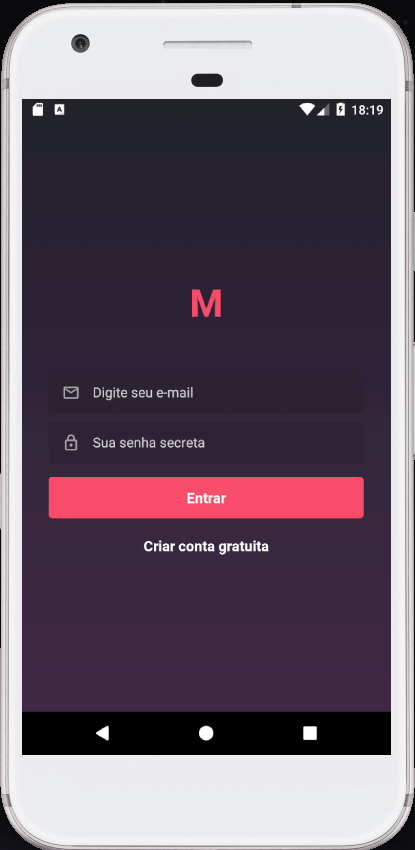
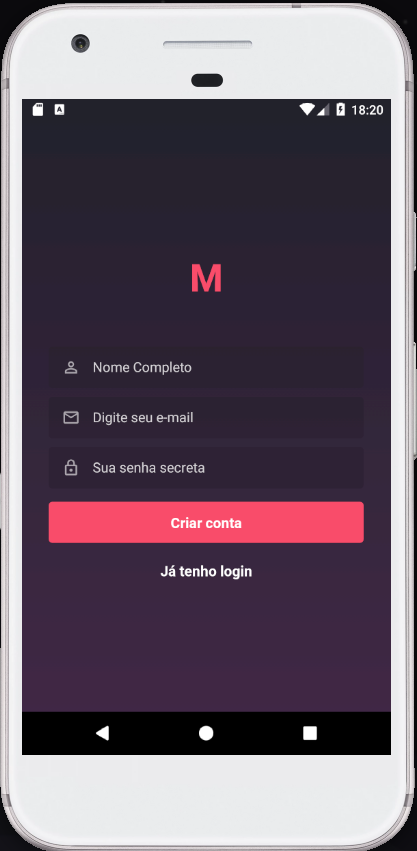
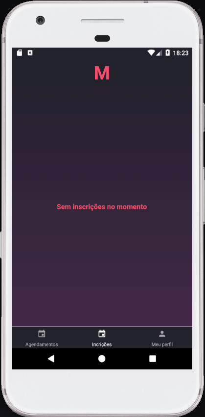
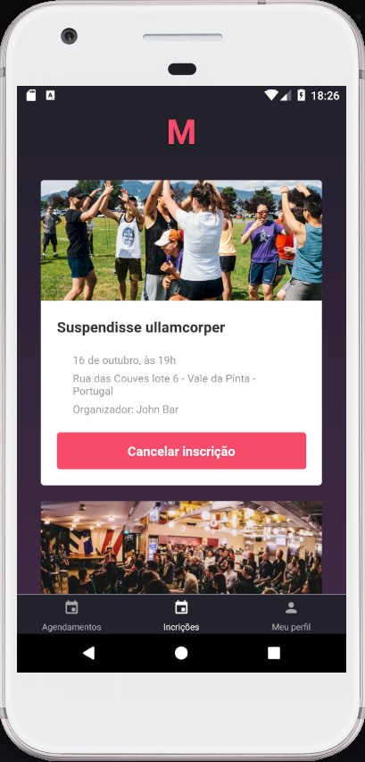
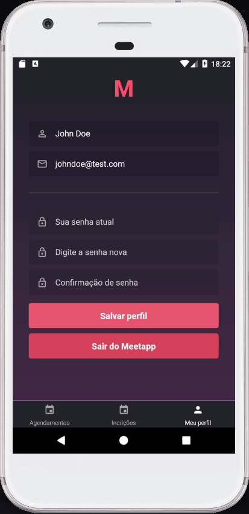

<p align="center">
  
</p>

# Aplicativo _Mobile_ em ReactNative para o desafio de certificação do Bootcamp GoStack da [Roketseat](http://rocketseat.com.br)

# **APENAS EM ANDROID**

## Aplicação: App _Mobile_ do Meetapp

O aplicativo utiliza a API do Meetapp ([pasta backend](url))

1. Esta aplicação será utilizada por inscritos nos _meetups_ e não contará com funcionalidades de organização de _meetups_.

2. As telas são:

- SigIn: para autenticação do usuário;
- SignUp: para criação de nova conta de usuário;
- Dashboard: páginal inicial quando autenticado e apresenta a lista de meetups por data, paginados de acordo com a API e com adição de novas páginas com o final do _scroll_ (_onEndReached_). Nesta página é possível realizar inscrição em um _meetup_ não organizado pelo usuário autenticado;
- Incrições: tela de vizualização da lista de _meetups_ inscritos pelo usuário autenticado e que ainda não ocorreram. O usuário pode cancelar inscrições nesta tela; e
- Perfil: para edição das informações do usuário autenticado.

<p align="center" style="margin: 25px 0">
  
  
  
  
  
  
</p>

## Instalação e Inicialização

```
cd mobile_android
```

e

```
npm install
```

ou

```
yarn
```

e

```
react-native start
```

e

```
react-native run:android
```

Acesse pelo Emulador ou aparelho físico.

- Caso as imgens não estejam sendo renderizadas:

```sh
adb reverse tcp:3333 tcp:3333
```

- Caso o reactotron não encontre a conexão:

```sh
adb reverse tcp:9090 tcp:9090
```

## Agradecimentos

Aos desenvolvedores e mantenedores das seguintes bibliotecas:

- [@react-native-community/async-storage]()
- [@react-native-community/datetimepicker]()
- [axios (MIT)](https://github.com/axios/axios);
- [date-fns (MIT)](https://github.com/date-fns/date-fns);
- [immer (MIT)](https://github.com/immerjs/immer);
- [prop-types (MIT)](https://github.com/facebook/prop-types);
- [react (MIT)](https://github.com/facebook/react);
- [react-native]()
- [react-native-gesture-handler]()
- [react-native-linear-gradient]()
- [react-native-reanimated]()
- [react-native-vector-icons]()
- [react-navigation]()
- [react-navigation-stack]()
- [react-navigation-tabs]()
- [react-redux]()
- [reactotron-react-native]()
- [reactotron-redux (MIT)](https://github.com/infinitered/reactotron-redux);
- [reactotron-redux-saga (MIT)](https://github.com/infinitered/reactotron-redux-saga);
- [react-redux (MIT)](https://github.com/reduxjs/react-redux);
- [redux-persist (MIT)](https://github.com/rt2zz/redux-persist);
- [redux-saga (MIT)](https://github.com/redux-saga/redux-saga);
- [styled-components (MIT); ](https://github.com/styled-components/styled-components).

## License

MIT © mourabraz@hotmail.com
